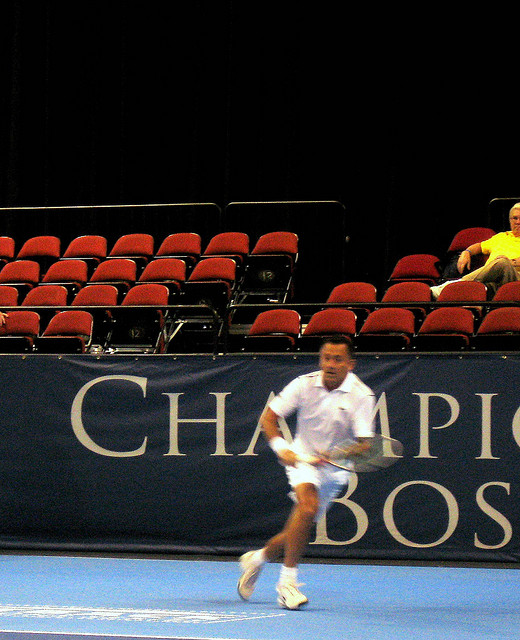
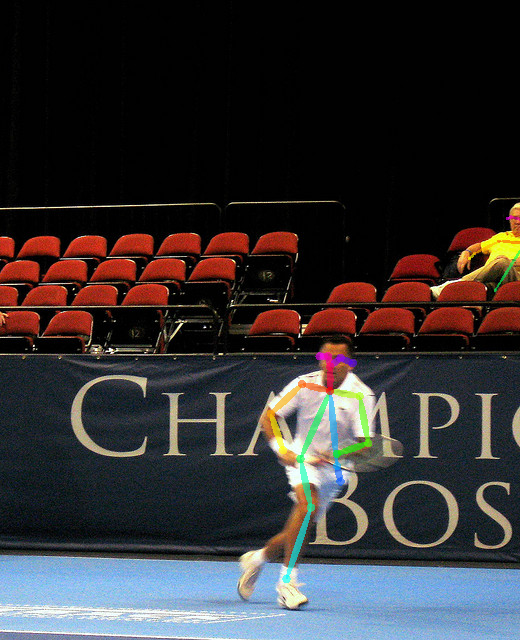
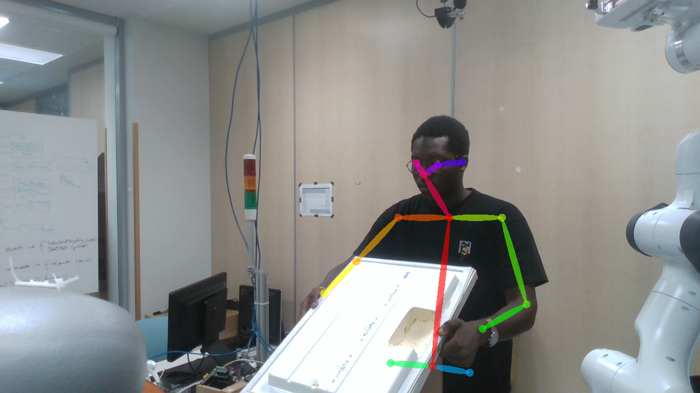

# Human Action Recognition Pytorch LSTM
- In this repository, you'll find a notebook, with an LSTM as the model and it was trained on the MHAD dataset.
- Instead of feeding raw images to our model, we will feed it with time series data. We used openpose on a dataset of images because we needed pose estimatin and it's one of the module that allows us to realize that.

As you can see on the image below, we have a tenisman

Now after running openpose on this image, we have:

## Implementations 

The goal of this project is to facilitte human and robot to colaboration in collaborative environments for example an environment of assembly and disassembly.
In our case it's all about disassembling fridge doors. In order to train our model to recognise these types of actions, we will have to create our own dataset.

This dataset is comprised of 12 subjects doing the following 5 actions for 5 repetitions, filmed from 3 angles, repeated 5 times each.   

- Waiting 
- Changing the side (in case it's a 2 door fridge)
- closing door
- opening door
- extracting drawers and shelves

The input for the LSTM is the 2D position of 18 joints across a timeseries of frames numbering n_steps (window-width), with an associated class label for the frame series.

## Choices of our model

First of all, a large part of this internship has been devoted to research and its only after 2 months of researching this subject that we were able to have the first results. We chose an LSTM as the backbone of our model because it's one of the rare model that can exploit the spatio-temporal context that's present in a video or a sequence of images. 

As our project focus on increasing the safety of human operators in collaborative environments with robots, we decided to go with that implementation (simple LSTM) for the first trials. As of now, we trained the LSTM on a modification of the MHAD dataset, we were inspired by the work made here https://github.com/stuarteiffert/RNN-for-Human-Activity-Recognition-using-2D-Pose-Input#dataset-overview , it was mind blowing. I realized that i could send the skeleton keypoints directly to the model if i formatted if in a good way. This was my main idea when we decided to go for the LSTM model. So we implemented it and you can finthe result of our training and validation in the notebook. Also, you'll find the confusion matrix where we can clearly see that different actions aren't getting confused, however, close actions (clapping_hands and boxing), we see that our model is having trouble to differentiate them.

## Custom dataset

After training our model, we decided to take it to the next step which was to train it with our own dataset. In order to have a wide set of data which we can use, we set up our own protocol of test. It consisted in, 3 cameras from 3 different angles, 3 subjects realizing two sets of actions (opening the door and closing the door) and each of them repeating the same action 5 times. We had a total of 2632 frames. 

Now , we needed to un openpose on a directory full of our images and get the skeleton keypoints. Then we can send them to our network and train like they are doing in the repository i mentionned earlier. 

This is me realizing the action of closing the door of a fridge (it's one of the last frames).
